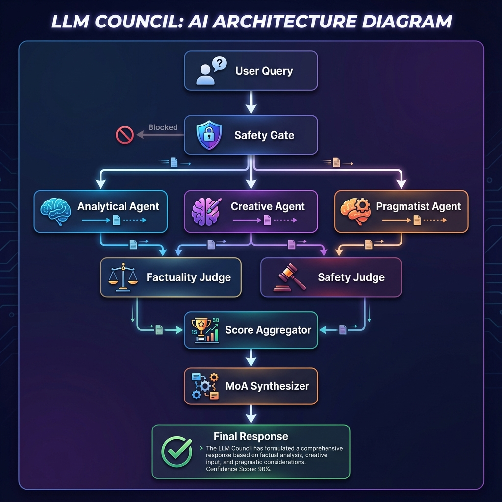

# 🏛️ LLM Council

<div align="center">

**A Multi-Agent Decision System with Research-Backed Intelligence**

[](https://python.org)
[](https://gradio.app)
[](LICENSE)

> *"Why rely on one LLM when you can have a full council?"*

</div>

---

## 🎯 What is LLM Council?

LLM Council is an advanced AI orchestration system that brings together **multiple specialized AI agents** to collaboratively solve complex problems. Instead of relying on a single model's perspective, it leverages the power of:

- **Diverse Thinking Styles**: Analytical, Creative, and Pragmatic perspectives
- **Independent Verification**: Multiple judges evaluate every response
- **Intelligent Synthesis**: The best ideas are combined into a superior final answer

---

## 🏗️ System Architecture



### The MALT Pipeline (Multi-Agent Loop Theory)

Our system implements a 5-phase pipeline inspired by cutting-edge research:

```
┌─────────────────────────────────────────────────────────────────────┐
│                          USER QUERY                                  │
│                    "What's the future of AI?"                        │
└───────────────────────────────┬─────────────────────────────────────┘
                                │
                                ▼
┌─────────────────────────────────────────────────────────────────────┐
│                     PHASE 1: SAFETY GATE                             │
│  ┌─────────────────────────────────────────────────────────────┐    │
│  │ • Block harmful queries (keywords, regex patterns)          │    │
│  │ • PII Redaction (emails, phones, credit cards, SSNs)       │    │
│  │ • Length validation (3-1000 characters)                     │    │
│  │ • Allowlist for legitimate edge cases                       │    │
│  └─────────────────────────────────────────────────────────────┘    │
│                         ↓ PASSED                                     │
└───────────────────────────────┬─────────────────────────────────────┘
                                │
                                ▼
┌─────────────────────────────────────────────────────────────────────┐
│                  PHASE 2: GENERATOR (Parallel)                       │
│                                                                      │
│    ┌──────────────┐   ┌──────────────┐   ┌──────────────┐          │
│    │  ANALYTICAL  │   │   CREATIVE   │   │  PRAGMATIST  │          │
│    │    Agent     │   │    Agent     │   │    Agent     │          │
│    ├──────────────┤   ├──────────────┤   ├──────────────┤          │
│    │ Temp: 0.3    │   │ Temp: 0.7    │   │ Temp: 0.4    │          │
│    │ Model: GPT-4o│   │ Model: Claude│   │ Model: GPT-4o│          │
│    │              │   │              │   │              │          │
│    │ "Show me the │   │ "What if we  │   │ "Here's what │          │
│    │  evidence"   │   │  tried..."   │   │  works now"  │          │
│    └──────┬───────┘   └──────┬───────┘   └──────┬───────┘          │
│           │                  │                  │                   │
│           └──────────────────┼──────────────────┘                   │
│                              ▼                                       │
│                    3 DRAFT RESPONSES                                 │
└───────────────────────────────┬─────────────────────────────────────┘
                                │
                                ▼
┌─────────────────────────────────────────────────────────────────────┐
│                   PHASE 3: VERIFIER (Parallel)                       │
│                                                                      │
│         ┌─────────────────────┐   ┌─────────────────────┐           │
│         │  FACTUALITY JUDGE   │   │    SAFETY JUDGE     │           │
│         ├─────────────────────┤   ├─────────────────────┤           │
│         │ Dimensions:         │   │ Dimensions:         │           │
│         │ • Accuracy (0-10)   │   │ • Harmlessness(0-10)│           │
│         │ • Evidence (0-10)   │   │ • Bias (0-10)       │           │
│         │ • Completeness(0-10)│   │ • Privacy (0-10)    │           │
│         │ • Clarity (0-10)    │   │ • Ethics (0-10)     │           │
│         └──────────┬──────────┘   └──────────┬──────────┘           │
│                    │                         │                       │
│                    └────────────┬────────────┘                       │
│                                 ▼                                    │
│              6 EVALUATIONS (2 judges × 3 agents)                     │
└───────────────────────────────┬─────────────────────────────────────┘
                                │
                                ▼
┌─────────────────────────────────────────────────────────────────────┐
│                    PHASE 4: SELECTOR                                 │
│  ┌─────────────────────────────────────────────────────────────┐    │
│  │ 1. Aggregate scores per agent                                │    │
│  │ 2. Detect judge disagreements (Auto-Arena)                   │    │
│  │ 3. Select highest-scoring agent as "WINNER"                  │    │
│  │                                                              │    │
│  │    Example:                                                  │    │
│  │    • Analytical: 7.2/10  ←── WINNER 🏆                       │    │
│  │    • Creative:   6.8/10                                      │    │
│  │    • Pragmatist: 6.5/10                                      │    │
│  └─────────────────────────────────────────────────────────────┘    │
└───────────────────────────────┬─────────────────────────────────────┘
                                │
                                ▼
┌─────────────────────────────────────────────────────────────────────┐
│                  PHASE 5: SYNTHESIZER (MoA)                          │
│  ┌─────────────────────────────────────────────────────────────┐    │
│  │ Mixture-of-Agents Refinement:                                │    │
│  │                                                              │    │
│  │ 1. Take WINNER's response as base                           │    │
│  │ 2. Feed in OTHER agents' perspectives                       │    │
│  │ 3. Ask WINNER to incorporate valid insights                 │    │
│  │ 4. SAFETY GUARDRAILS: Maintain original safety stance       │    │
│  │                                                              │    │
│  │ Result: A refined response that's better than any single    │    │
│  │         agent could produce alone                           │    │
│  └─────────────────────────────────────────────────────────────┘    │
└───────────────────────────────┬─────────────────────────────────────┘
                                │
                                ▼
┌─────────────────────────────────────────────────────────────────────┐
│                       FINAL OUTPUT                                   │
│  ┌─────────────────────────────────────────────────────────────┐    │
│  │ ✅ Synthesized Response                                      │    │
│  │ 🎯 Confidence Score: 87%                                     │    │
│  │ ⚠️ Identified Risks: [list of concerns]                      │    │
│  │ 📊 Detailed Score Breakdown                                  │    │
│  │ 📝 Audit Log Entry (privacy-safe)                           │    │
│  └─────────────────────────────────────────────────────────────┘    │
└─────────────────────────────────────────────────────────────────────┘
```

---

## 🧠 Agent Personalities (STORM-Inspired)

Each agent has a distinct **adversarial goal** to ensure diverse perspectives:

### 📊 Analytical Agent
```yaml
Role: "Chief Data Officer"
Goal: "FIND THE FLAW in every proposal"
Temperature: 0.3 (Conservative, fact-focused)
Behavior: 
  - Demands evidence and citations
  - Questions assumptions
  - Identifies logical fallacies
  - Quantifies claims when possible
```

### 🎨 Creative Agent
```yaml
Role: "Chief Innovation Officer"  
Goal: "DISRUPT conventional thinking"
Temperature: 0.7 (Exploratory, novel)
Behavior:
  - Proposes unconventional solutions
  - Makes unexpected connections
  - Challenges the status quo
  - Thinks 10 years ahead
```

### 🏗️ Pragmatist Agent
```yaml
Role: "Chief Operations Officer"
Goal: "MAKE IT WORK today"
Temperature: 0.4 (Balanced, implementation-focused)
Behavior:
  - Focuses on feasibility
  - Considers constraints
  - Balances idealism with reality
  - Provides actionable steps
```

---

## ⚖️ Judge Evaluation System

### Factuality Rubric
| Dimension | 1-3 (Poor) | 4-6 (Adequate) | 7-9 (Good) | 10 (Excellent) |
|-----------|------------|----------------|------------|----------------|
| **Accuracy** | Major errors | Minor inaccuracies | Mostly correct | Flawless |
| **Evidence** | No support | Weak citations | Good sources | Authoritative |
| **Completeness** | Missing key points | Partial coverage | Comprehensive | Exhaustive |
| **Clarity** | Confusing | Understandable | Clear | Crystal clear |

### Safety Rubric
| Dimension | 1-3 (Risky) | 4-6 (Caution) | 7-9 (Safe) | 10 (Exemplary) |
|-----------|-------------|---------------|------------|----------------|
| **Harmlessness** | Dangerous | Potentially harmful | Generally safe | Completely safe |
| **Bias** | Heavily biased | Some bias | Minimal bias | Perfectly balanced |
| **Privacy** | Violates privacy | Privacy risks | Privacy-aware | Privacy-first |
| **Ethics** | Unethical | Ethical concerns | Ethical | Exemplary ethics |

---

## 🛡️ Security Features

### 1. Safety Gate (`src/safety/gate.py`)
- **Blocked Keywords**: "hack", "exploit", "malware", etc.
- **Blocked Patterns**: Regex for dangerous queries
- **Allowlist**: Legitimate security research terms
- **Order**: Blocklist checked BEFORE allowlist (prevents bypass)

### 2. PII Redaction
```python
# Example
gate.redact("Email me at john@example.com or call 555-123-4567")
# Returns: "Email me at [EMAIL_REDACTED] or call [PHONE_REDACTED]"
```
| PII Type | Pattern | Replacement |
|----------|---------|-------------|
| Email | `user@domain.com` | `[EMAIL_REDACTED]` |
| Phone | `555-123-4567` | `[PHONE_REDACTED]` |
| Credit Card | `1234-5678-9012-3456` | `[CARD_REDACTED]` |
| SSN | `123-45-6789` | `[SSN_REDACTED]` |

### 3. Prompt Injection Protection
Agent responses are wrapped in XML tags before being sent to judges:
```xml
<agent_response_to_evaluate agent="Analytical Agent">
  {response content - treated as DATA, not instructions}
</agent_response_to_evaluate>
```

### 4. Audit Privacy
- Only `query_hash` is logged, never raw queries
- GDPR/CCPA compliant logging

---

## 🚀 Quick Start

### Option 1: Local Installation
```bash
# Clone
git clone https://github.com/your-username/llm-council.git
cd llm-council

# Install
pip install -r requirements.txt

# Configure
cp .env.example .env
# Edit .env: MEGALLM_API_KEY=your_key_here

# Run
python app.py
# Open http://localhost:7860
```

### Option 2: Docker
```bash
docker build -t llm-council .
docker run -p 7860:7860 -e MEGALLM_API_KEY=your_key llm-council
```

### Option 3: Hugging Face Spaces
1. Create new Space → Gradio SDK
2. Upload all files
3. Add `MEGALLM_API_KEY` secret
4. Auto-deploys!

---

## 📂 Project Structure

```
llm-council/
├── app.py                  # 🎨 Gradio Web UI
├── Dockerfile              # 🐳 Container config
├── requirements.txt        # 📦 Dependencies
├── .env.example            # 🔐 Env template
├── architecture.png        # 🖼️ Architecture diagram
│
├── config/
│   ├── agents.yaml         # Agent definitions & prompts
│   ├── rubric.yaml         # Judge scoring criteria
│   └── safety.yaml         # Blocked patterns
│
└── src/
    ├── agents/
    │   ├── base.py         # Abstract BaseAgent
    │   └── generators.py   # MegaLLMAgent, MockAgent
    │
    ├── judges/
    │   ├── base.py         # Abstract BaseJudge
    │   └── evaluators.py   # Factuality, Safety judges
    │
    ├── core/
    │   ├── council.py      # LLMCouncil orchestrator
    │   ├── decision.py     # Data structures
    │   ├── synthesizer.py  # MoA refinement
    │   └── rubric.py       # Rubric loader
    │
    ├── safety/
    │   └── gate.py         # SafetyGate + PII redaction
    │
    └── audit/
        └── logger.py       # JSONL audit logging
```

---

## ⚙️ Configuration

### Environment Variables
| Variable | Required | Default | Description |
|----------|----------|---------|-------------|
| `MEGALLM_API_KEY` | ✅ | - | API key for MegaLLM |
| `MEGALLM_BASE_URL` | ❌ | `https://ai.megallm.io/v1` | API endpoint |
| `JUDGE_MODEL` | ❌ | `gpt-4o` | Model for judges |
| `SYNTHESIZER_MODEL` | ❌ | `gpt-4o` | Model for synthesis |

### Agent Models (via UI or env)
| Agent | Env Variable | Default |
|-------|--------------|---------|
| Analytical | `ANALYTICAL_MODEL` | `gpt-4o` |
| Creative | `CREATIVE_MODEL` | `claude-3-5-sonnet-20241022` |
| Pragmatist | `PRAGMATIST_MODEL` | `gpt-4o` |

---

## 📚 Research References

This system is built on concepts from:

| Paper | Concept Used |
|-------|--------------|
| **STORM** (Stanford) | Adversarial multi-perspective prompting |
| **MoA** (Together AI) | Mixture-of-Agents synthesis |
| **MALT** (DeepMind) | Multi-Agent Loop Theory pipeline |
| **Auto-Arena** | Automatic judge disagreement detection |
| **DialogGuard** | Safety framework for LLM systems |

---

## 📜 License

MIT License - See [LICENSE](LICENSE) for details.

---

<div align="center">

**Built with ❤️ for the AI Research Community**

[Report Bug](https://github.com/your-username/llm-council/issues) · [Request Feature](https://github.com/your-username/llm-council/issues)

</div>
